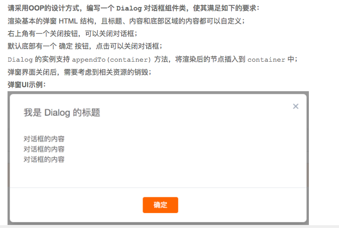

# oopDialog
## oop思想(开闭原则)设计dialog组件
这是阿里前端笔试的一道题，当时没想出来怎么划分，做完后觉得很有意思就把它截了图实现一下。题目：

## [在线尝试](http://bycrazystone.com/searchBar)
### 主要封装dialog：
封装dialog类该部分封装好无需修改：
```javascript
function dialogCreator(components) {
    var dialog = {};
    dialog.render = function () {
        var dialogWrapper = document.createElement("dialog");
        dialogWrapper.className = "dialogWrapper";
        dialogWrapper.id = "dialogWrapper";
        //右上角关闭
        var dialogCloser = document.createElement("div");
        dialogCloser.className = "dialogCloser";
        var closerA = document.createElement("a");
        closerA.addEventListener('click', function () {
            dialogWrapper.close();
        })
        var X = document.createTextNode("X");
        closerA.appendChild(X);
        dialogCloser.appendChild(closerA);
        //插入dialog
        dialogWrapper.appendChild(dialogCloser);
        //插入传入的组件
        if (components) {
            components.forEach(function (val) {
                dialogWrapper.appendChild(val);
            })
        }
        return dialogWrapper;
    }
    dialog.appendTo = function (container) {
        container.appendChild(this.render());
    }
    return dialog;
}
```
### dialog组件中有三部分，将其共有部分拆出构成component类，三部分由业务需求自己实现
该部分同样无需修改
```javascript
function componentCreator(className, myRender) {
    var component = {};
    className = className || '';
    myRender = myRender || {};
    myRender.renderContent = function () {
        throw "You haven't implemented!"
    }
    component.render = function () {
        var div = document.createElement("div");
        div.className = className;
        div.appendChild(myRender.renderContent());
        return div;
    }
    return component;
}
```
### 三部分内容由业务需求去实现组件类
```javascript
function titleCreator(titobj) {
    titobj = titobj || {};
    var myRender = {},
        className = titobj.className,
        component = componentCreator(className, myRender);
    myRender.renderContent = function () {
        var p = document.createElement("p");
        p.className = "p";
        p.innerHTML=titobj.text;
        return p;
    }
    return component;
}
function contentCreator(conobj) {
    conobj = conobj || {};
    var myRender = {},
        className = conobj.className,
        component = componentCreator(className, myRender);
    myRender.renderContent = function () {
        var div=document.createElement("div");
        conobj.text.forEach(function (val){
            var p = document.createElement("p");
            p.className = "p";
            p.innerHTML=val;
            div.appendChild(p);
        })
        return div;
    }
    return component;
}
function bottomCreator(botobj) {
    botobj = botobj || {};
    var myRender = {},
        className = botobj.className,
        component = componentCreator(className, myRender);
    myRender.renderContent = function () {
        var button = document.createElement("button");
        button.className = "button";
        button.innerHTML=botobj.text;
        button.addEventListener('click',function () {
            document.getElementsByClassName("dialogWrapper")[0].close();
        })
        return button;
    }
    return component;
}
```
将内容填充到dialog组件中，再将组件加入到DOM容器里。
